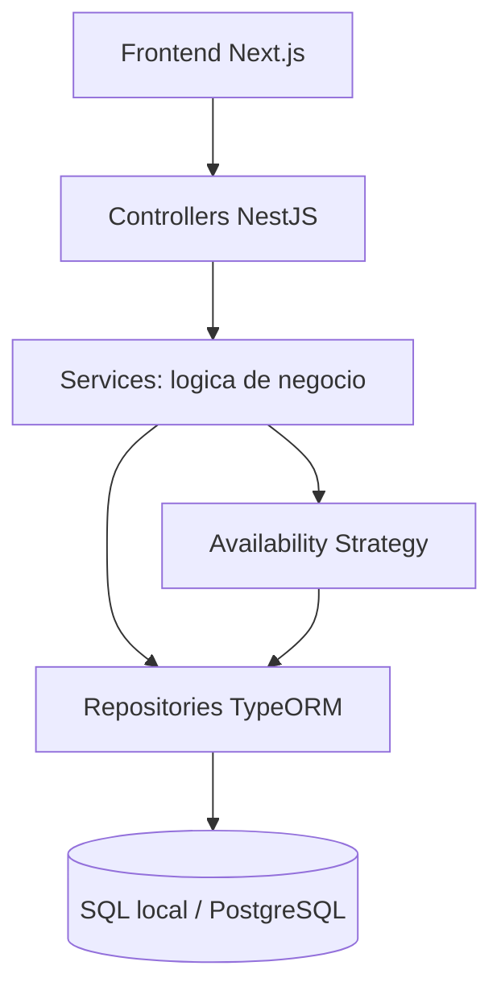
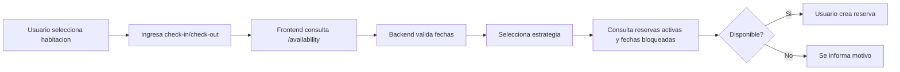
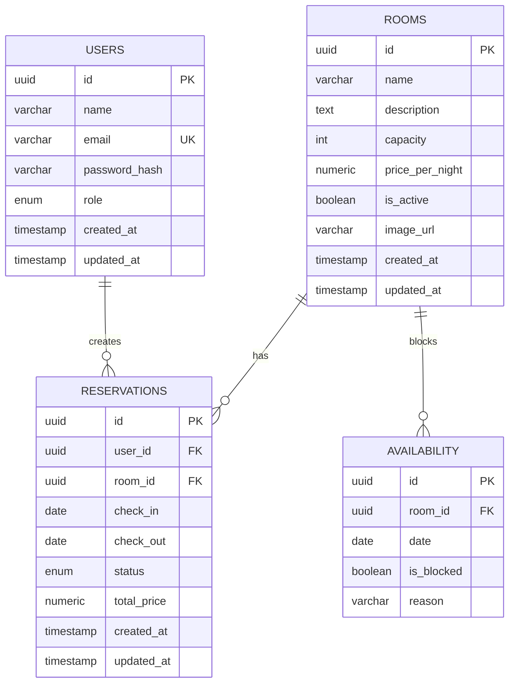
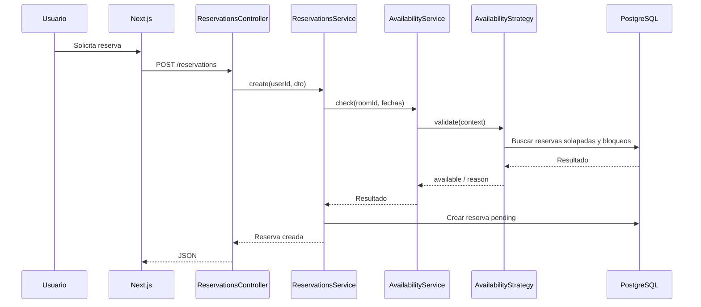

# Documentacion tecnica: Sistema de reservas hoteleras

## 1. Introduccion

Este proyecto implementa un sistema web de reservas de hotel/hospedaje. Permite a usuarios consultar habitaciones, validar disponibilidad y crear reservas. Tambien ofrece un panel administrador para gestionar habitaciones, disponibilidad y estados de reservas.

El sistema esta construido como monolito modular, no como microservicios. Cada modulo conserva responsabilidades claras y se comunica dentro del mismo proceso de aplicacion.

## 2. Problematica

Un hotel necesita controlar la disponibilidad de sus habitaciones evitando reservas duplicadas. El problema principal es validar correctamente los rangos de fechas, los estados de reserva y los bloqueos administrativos, ya que una consulta incompleta puede producir overbooking.

## 3. Justificacion tecnica

Se eligio NestJS porque facilita una arquitectura modular por controllers, services y providers. TypeORM permite modelar entidades relacionales, mantener repositorios separados y cambiar el motor de base de datos por configuracion. En ejecucion local se usa una base embebida `sql.js` persistida en archivo; para entrega o despliegue puede activarse PostgreSQL.

La arquitectura en capas permite separar:

- Presentacion: controllers NestJS y pantallas Next.js.
- Logica de negocio: services y estrategias de disponibilidad.
- Acceso a datos: repositories TypeORM.
- Base de datos: SQL local embebido o PostgreSQL, con tablas, relaciones e indices.

## 4. Arquitectura implementada



Flujo por capas:

```txt
Controller -> Service -> Repository -> Base de datos
```

Ejemplo de reserva:

```txt
ReservationsController
  -> ReservationsService
    -> AvailabilityService
      -> AvailabilityStrategyFactory
        -> Seasonal/Weekend/NormalAvailabilityStrategy
          -> ReservationRepository + AvailabilityRepository
    -> ReservationRepository
```

## 5. Componentes

- `auth`: registro, login, firma JWT y estrategia Passport JWT.
- `users`: persistencia y consulta de usuarios.
- `rooms`: CRUD administrativo y consulta publica de habitaciones activas.
- `reservations`: creacion, consulta y cambio de estado de reservas.
- `availability`: consulta de disponibilidad, bloqueo de fechas y Strategy Pattern.
- `common`: guards, decorators, enums y utilidades transversales.
- `database`: configuracion TypeORM con SQL local embebido o PostgreSQL.

## 6. Flujo del sistema



## 7. Ventajas y desventajas

Ventajas:

- Separacion clara entre presentacion, negocio y datos.
- Modulos independientes dentro de un monolito mantenible.
- Reglas de disponibilidad extensibles mediante Strategy.
- PostgreSQL protege integridad con relaciones, indices y llaves foraneas.

Desventajas:

- El monolito escala como una sola unidad de despliegue.
- `synchronize: true` es practico para academia/desarrollo, pero en produccion conviene migraciones TypeORM.
- Las reglas estacionales estan codificadas como ejemplo academico y podrian moverse a configuracion persistente.

## 8. Patron Strategy

El patron Strategy se implementa en:

```txt
backend/src/modules/availability/strategies/
  availability-strategy.ts
  normal-availability.strategy.ts
  weekend-availability.strategy.ts
  seasonal-availability.strategy.ts
```

Problema que resuelve:

No todas las fechas se validan igual. Una reserva normal solo requiere validar solapamientos y bloqueos, pero fines de semana y temporadas altas pueden exigir noches minimas o reglas adicionales.

Estrategias:

- `NormalAvailabilityStrategy`: valida habitacion activa, bloqueos y conflictos con reservas no canceladas.
- `WeekendAvailabilityStrategy`: aplica la validacion normal y exige minimo 2 noches si inicia viernes o sabado.
- `SeasonalAvailabilityStrategy`: aplica la validacion normal y exige minimo 3 noches en enero, julio o diciembre.

Ventaja:

Agregar una nueva regla no obliga a modificar todo el servicio de reservas. Se crea una nueva estrategia y se registra en `AvailabilityStrategyFactory`.

## 9. Logica de negocio

Reglas implementadas:

- `check_out > check_in`.
- Habitaciones inactivas no pueden reservarse.
- Reservas canceladas no afectan disponibilidad.
- Estados: `pending`, `confirmed`, `cancelled`, `completed`.
- No se permite doble reserva.

Consulta logica de conflicto:

```sql
SELECT *
FROM reservations
WHERE room_id = ?
AND status != 'cancelled'
AND (
  check_in < nueva_fecha_salida
  AND check_out > nueva_fecha_entrada
);
```

En TypeORM se implementa en `ReservationRepository.findConflicting`.

## 10. Modularidad

Cada modulo de backend contiene su controller, service, repository, DTOs y entidad cuando aplica. Esto permite identificar claramente las capas:

- Controller: recibe HTTP y valida entrada con DTOs.
- Service: contiene reglas de negocio.
- Repository: encapsula consultas TypeORM.
- Entity: representa tablas y relaciones.

El frontend separa componentes reutilizables (`NavBar`, `RoomCard`) y rutas por experiencia de usuario (`rooms`, `login`, `register`, `admin`).

## 11. Modelo relacional



Indices destacados:

- `users.email` unico.
- `rooms.name`.
- `rooms.is_active`.
- `reservations(room, check_in, check_out)`.
- `reservations.status`.
- `availability(room, date)` unico.
- `availability.date`.

## 12. Flujo de reservas



## 13. Instrucciones de ejecucion

1. Copiar `backend/.env.example` a `backend/.env`.
2. Copiar `frontend/.env.local.example` a `frontend/.env.local`.
3. Para correr sin VM ni Docker, dejar `DATABASE_TYPE=sqljs`.
4. Instalar dependencias:

```bash
npm install
```

5. Ejecutar backend:

```bash
npm run dev:backend
```

6. Ejecutar frontend:

```bash
npm run dev:frontend
```

## 14. Ejemplos de endpoints

Registro:

```http
POST /api/auth/register
Content-Type: application/json

{
  "name": "Laura Gomez",
  "email": "laura@mail.com",
  "password": "123456"
}
```

Consulta disponibilidad:

```http
GET /api/availability?roomId=ROOM_ID&checkIn=2026-06-01&checkOut=2026-06-04
```

Crear reserva:

```http
POST /api/reservations
Authorization: Bearer JWT
Content-Type: application/json

{
  "roomId": "ROOM_ID",
  "checkIn": "2026-06-01",
  "checkOut": "2026-06-04"
}
```

Cambiar estado:

```http
PATCH /api/reservations/RESERVATION_ID/status
Authorization: Bearer JWT_ADMIN
Content-Type: application/json

{
  "status": "confirmed"
}
```

## 15. Conclusiones

El proyecto demuestra una solucion funcional y academica para reservas hoteleras con arquitectura en capas, modularidad y un Strategy Pattern aplicado a reglas reales de disponibilidad. La validacion de solapamientos evita overbooking y los estados de reserva permiten que cancelaciones no bloqueen habitaciones.
